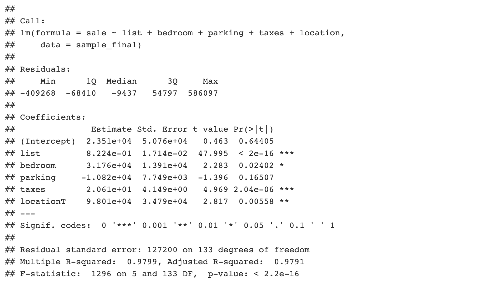

# Housing Sale Price Analysis with Multi-Linear Regression

The data that this report will be exploring was obtained from the Toronto Real Estate Board (TREB) on detached houses in two separate neighborhoods (a neighborhood in Toronto: neighborhood T) & (a neighborhood in Mississauga: neighborhood M). 

This data set contains the information of the following variables.
- ID: property identification
- sale: the actual sale price of the property in Canadian dollars
- list: the last list price of the property in Canadian dollars
- bedroom: the total number of bedrooms
- bathroom: the number of bathrooms
- parking: the total number of parking spots
- maxsqfoot: the maximum square footage of the property
- taxes: previous year’s property tax
- lotwidth: the frontage in feet
- lotlength: the length in feet of one side of the property
- location: M (for Mississauga), T (for Toronto)

We will use this data to establish a mulitple linear regression model (MLR) which home buyers can use to predict the sale price of single-family, detached homes in the two neighborhoods in the Greater Toronto Area.

Our main objectives for this data analysis report is…
1. Execute data manipulation, such as but not limited to, removing NA values, adding variables, removing variables and removing highly influential points from the dataset.
2. Execute exploratory data analysis, such as but not limited to, examine the correlations of quantitative variables and check constant variance assumption fulfillment.
3. Execute model creation, such as but not limited to, creation of full model and applications of backwards AIC & BIC.
4. Discuss model validity and limitations, such as but not limited to, examination of diagnostic plots and next steps.

## Data Preprocessing
Before we start working with our data, we will do some standard procedures for data pre-processing.
1. Set seed to 2020.
2. Randomly select a sample of 150 cases from the original data.
3. Create a new variable lotsize by multiplying lotwidth and lotlength. Lotsize will replace lotwidth and lotlength in the dataset.
4. Remove unnecessary variables from the dataset.
5. Remove NA values.
6. Remove bad leverage points from the dataset.

7. Run an initial multi-linear regression to identify leverage and influential points.

The first line in the output above shows leverage values of the data points to their corresponding ID’s. The second line shows Cook’s distance. As we can see observation 109 has both the highest leverage value and Cook’s distance. Thus, we will remove this point from the dataset, as it may be a bad leverage point. We have now cleaned our dataset. We will use this as our sample moving forward in our analysis. 

## Exploratory Data Analysis

Let us examine the pairwise correlations and scatterplot matrix for all pairs of quantative variables in the data.

Using the output above, we can describe how each quantitative predictor for sale price rank, in terms of their correlation coefficient from highest to lowest.

1. List (0.9856)
2. Taxes (0.7169)
3. Bathroom (0.6601)
4. Bedroom (0.4810)
5. Lotsize (0.2933)
6. Parking (0.0891)

Looking at the pairwise correlations we can check for multicollinearity between predictor variables. From the results there are no two predictors variables that are highly correlated with each other, enough to remove one of the predictor variables from the dataset.

To confirm this we will produce some vif values, using a threshold of 5 to check for multicollinearity.

Since none of the variables have a VIF of over 5, we can conclude that multicollinearity is not an issue with this dataset.

Our scatter plot matrix can give us an idea of which variables to look out for that violate their constant variance assumption. From our output above, we can see that for the scatter plot of sale price and parking, the plots are in the shape of a fan. This shows that as parking numbers increase, there is large variability in the change in sale price. Leading us to think that sales ~ parking will not satisfy the constant variance assumption. We will confirm our observation by examing the diagnostic plots.

Let us bring out attention to the Scale-Location plot, this plot shows the squared standardized residuals. As we can see it is not a straight line. This shows that the constant variance assumption is not satisfied, confirming our inkling from the scatter plot observations, that sale~price SLR model doesn’t satisfy the constant variance assumption.

## Methods & Model

First we will fit an additive linear regression model with all the available predictor variables for sale price. For our analysis we will be using a benchmark significance level of 5%.

From looking a the output above, we can see that the predictors that are significant in the full model are, list, bedroom, taxes and locationT. We will interpret the coefficients of the predictor variable that are significant in the model.

As the list price increases by one Canadian dollar, the sale price is expected to increase by 0.8186 Canadian dollars, holding all other independent predictor variables constant.

As the number of bedrooms increase by one bedroom, the sale price is expected to increase by 30810 Canadian dollars, holding all other independent predictor variables constant.

As the amount of tax increase by one Canadian dollar, the sale price is expected to increase by 20.51 Canadian dollars, holding all other independent predictor variables constant.

When the location is T (Toronto Neighborhood) as opposed to location is M (Mississauga), the sale price is expected to increase by 101600 Canadian dollars, holding all other independent predictor variables constant.

We would now like to compare the full model above with a model created using backwards elimination with AIC.

Below is the final fitted model from Backwards AIC.

Let us compare the full model to the Backwards AIC model. Firstly, both the full model and the Backward AIC have statistically significance F test results, indicative from the very small p-values (2.2e-16). In the final Backwards AIC model there model does not include the lotsize variable. Even though the Backwards AIC model has less predictor variables, the adjusted R squared is 0.9791, which is higher than the adjusted R squared of the full model, which is 0.9788. The significance levels for the variables have not changed between the full model and the Backwards AIC. The list variable is still significant to 0%, bedroom variable is still significant to 1%, taxes variable is still significant to 0% and the locationT variable is still significant to 0.1%. The coefficients and intercepts did not change very much when comparing the full model and the Backward AIC model. From these results, it seems that we should omit the lotsize variable from our MLR model, since our adjusted R squared is better without taking it into consideration.

We would also like to execute the model using Backward BIC. The output is shown below…

Below is the final fitted model from Backwards BIC.   

Let us compare the new Backward BIC model to the Backward AIC and the full model. Firstly, both the full model, Backward AIC and the Backward BIC modelhave statistically significance F test results, indicative from the very small p-values (2.2e-16). In the Backward BIC model we only take into account 3 predictor variables; list, taxes and locationT. This means in comparison to our Backward AIC model, we have dropped the variables bedroom and parking. While the Backward AIC and the full model showed the same significance levels for the predictor variables, in the Backward BIC model, the significance level for the list and taxes variable remains at 0%, however the location T variables increased in significance level from 0.1% to 0%, becoming significant for a confidence interval. In the Backwards BIC the intercept is also now newly statistically significant at a level of 0.1%, this was not seen in the full model or the Backward AIC model.

Comparing the adjusted R squared values across the models, it is as follows, Backwards BIC < full model < Backwards AIC; 0.9785 < 0.9788 < 0.9791. Our Backwards AIC model has the highest adjusted R squared value, while our Backwards AIC model has the lowest adjusted R squared value. This makes sense since the Backwards BIC model only takes into account 3 predictor variables, while the Backwards AIC model takes into account 5 predictor variables. When looking at the estimated coefficient values across our models, the same predictor variables have similar coefficient values across the models. It is noteworthy to point out that the estimated intercept in the Backwards BIC model increased from 19660 < 23510 < 74400; full model < Backwards AIC < Backwards BIC. The reason why the Backwards AIC and Backwards BIC models are not the same is because the BIC model penalizes free parameters more strongly.

The decision on which model is the best is still unclear, and also depends on the usage of the intended model. If we are working with big data and computation time is a concern, we may opt for the Backward BIC model that takes into account only 3 predictor variables. If we want to maximize our adjusted R squared, we would probably opt for the Backward AIC model.

## Discussions & Limitations

In this section we will discuss the validity of the models created in the section above, and run some diagnostics.
Here we output some of the diagnostic plots for the model we obtained in Section III Part III, which is the Backward BIC model.

Let us examine the four diagnostic plots outputted above to see whether our MLR assumptions are satisfied.

The first MLR assumption that we would like to satisfy is model linearity. That the mean of the response at each set of values of the predictors is a linear function of the predictors. To see if this assumption is satisfied we will examine the residuals vs fitted plot on the top left of the four plots. For the model linearity assumption to be satisfied we hope to see no trends or patterns in the plot. The trend is straight and centered around zero. Thus, we can determine that our model linearity assumption is satisfied for the Backward BIC mode.

The second MLR assumption that we would like to examine is uncorrelated errors assumption. This means the errors are independent and uncorrelated from each other. To determine if this assumption is satisfied we would have to check the method the data has been collected, or the design of the study. We randomly selected the sample for this study, so randomization has been attempted. There is no randomized treatment allocation. Due to the randomized sample selection, we will loosely say that this assumption has been satisfied.

The third MLR assumption that we would like to examine is the constant variance assumption. This means that the errors at each set of values of the predictors should have equal variances. To see if this assumption is satisfied we will examine the scale-location plot on the bottom left of the four plots. For the constant variance assumption to be satisfied we hope to see no trends in this plot, we look for a null plot. The trend in the Scale-Location plot is straight, except for the beginning of the trend line which dips down slightly. For the most part we can say that the constant variance assumption is fulfilled, given this Scale-Location plot.

The fourth MLR assumption that we would like to examine is the normality of errors assumption. This means that the errors at each set of values of the predictors should be normally distributed. To see if the normal error MLR assumption is satisfied we will examine the plot on the top right of the four plots. For the normality of errors assumption to be satisfied, the data points should closely follow the straight line at a 45 degree angle upwards, any deviation would indicate a lack of error normality. Looking at the Normal Q-Q plot above, we can see that there is deviation from the line at the end of the line, highlighted are the points 43, 17 and 130. These deviations should be considered, so we will not say that the normality of errors assumption is satisfied, but rather something that should be remedied. A possible remedy is to remove the data points 43, 17 and 130 from the dataset.

From the analysis we have done so far, we can see that more work has to be done for us to get to our valid final model.

Some of the next steps I will take to find our final valid model are, to remove some of the data points from the data set that show up in the normal Q-Q plot. Removing these values will hopefully help to achieve the normality of errors assumption, being an effective remedy. Another possible direction we can take to satisfy the normality of errors assumption is to execute a box-cox transformation. This method will find the transformation that makes the transformed variable close to normally distributed. This way we will be able to normalize the errors for each predictor variable, rather than trying to satisfy the error by removing a couple points. However, it is noteworthy that conducting these transformations on the predictor variables does not gurantee an improvement in the results of the MLR.

Another step I would take would be to execute some added variable plots, this will help us visually assess each predictor variable. Using this method will help us determine which predictors to include in the model, beyond the multicollinearity consideration that we did in our analysis above.

In our analysis so far we have used backwards elimination, which removes predictor variables with the largest p-value from the model. In our next step I would also attempt a stepwise regression method, which combines forward and backwards elimination, where at each stage ter,s can be added, dropped and swapped. This will allow for a greater testing and possibility of different subsets of predictor variable outcomes in our final model.

Finally, the last next step I would execute would be some penalized linear regression. If the aim of the model creation would be to create a good enough model with the least amount of variables, I would use the lasso penalty method for the variable selection, as the coefficients are able to shrink to zero. I may opt for ridge regression when I know that most of the predictors will impact the response variable. However, these techniques are optimized for prediction rather than inference, so this should be considered when attempting these methods.

All this considered, before any next steps should be taken, we would need to determine the aim of the final model and what it is trying to achieve. From there we can determine whether we want to place importance on minimizing AIC/BIC values, minimizing adjusted R squared, minimize computation time for a good enough model, or if we want to prioritize inference over predictability.

This concludes the data analysis report. Thank you for reading!
